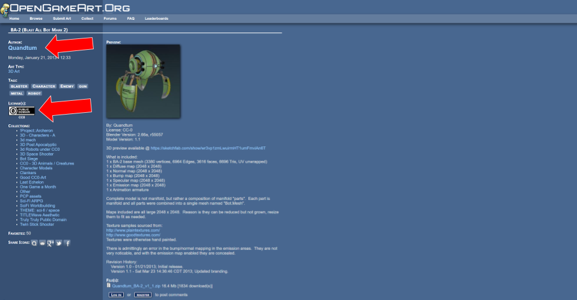

# Introdução

Esse site contém instruções que cada equipe (e seus integrantes) do PRACTICE deve seguir para produzir conteúdo. Utilize o menu do lado esquerdo para saber mais sobre um determinado assunto.

## Links rápidos

* [Pasta do Google Drive do programa](https://drive.google.com/drive/folders/1awqYC9rMMGVIrrYheihE5rSf1lHHisJw)
* [Lista de repositórios/projetos do programa no Github](https://github.com/practice-uffs)
* [Repositório principal do programa no Github](https://github.com/practice-uffs/programa)
* [Quadro com tarefas da sprint](https://github.com/orgs/practice-uffs/projects/1)
* [Site oficial do programa](https://practice.uffs.edu.br) (provisoriamente é [practice.uffs.cc](https://practice.uffs.cc]))
* [Identidade visual do programa](https://drive.google.com/drive/folders/1ymOvitNBOkBeU2RStVchrD6Rg8Ar4FB-)

## Os 10 mandamentos da equipe

1. **Nunca** usarei materiais que não informam sua licença de uso;
2. Só usarei materiais licenciados como: [domínio público](https://creativecommons.org/share-your-work/public-domain/cc0/) (CC0 ou _public domain_), [CC BY 3.0](https://creativecommons.org/licenses/by/3.0/deed.pt), [CC BY 4.0](https://creativecommons.org/licenses/by/4.0/deed.pt), ou [CC BY-SA 4.0](https://creativecommons.org/licenses/by-sa/4.0/deed.pt);
3. Para cada material que utilizar, anotarei a) fonte/link, b) nome do autor(a) e c) licença;
4. Utilizarei apenas softwares grátis ou de código-aberto para criar conteúdo;
5. _"Se não estiver no Github, isso não existe."_;
6. Tentarei usar formatos de documentos na núvem que outros consigam colaborar ao mesmo tempo comigo, ex.: Google Docs;
7. Colocarei dados, documentos e arquivos no [Google Drive do programa](https://drive.google.com/drive/folders/1awqYC9rMMGVIrrYheihE5rSf1lHHisJw);
8. Farei discussões/questionamentos das tarefas somente via comentários das issues;
9. Usarei WhatsApp/Telegram para agilizar a comunicação, não para substituir discussões nos issues;
10. Participarei das reuniões de sprint todas as sexta-feiras.

# Onde consigo coisas?

## Fotografias

### [unsplash.com/](https://unsplash.com/)

Todas as imagens listadas nesse site são domínio público (_CC0 ou _public domain_), então elas podem ser usadas livremente (inclusive sem creditar o autor(a)). Por respeito ao trabalho alheio, mencione a fonte como `unsplash.com`.

## Ilustrações

### [undraw.co](https://undraw.co/illustrations)

Todas as ilustrações listadas nesse site são domínio público (_CC0 ou _public domain_), então elas podem ser usadas livremente (inclusive sem creditar o autor(a)). Por respeito ao trabalho alheio, mencione a fonte como `undraw.co`.

!> Importante: como cor principal da ilustração, escolha uma das cores oficiais do programa.

### [Kenney Assets](https://www.kenney.nl/assets)

Todas as ilustrações listadas nesse site são domínio público (_CC0 ou _public domain_), então elas podem ser usadas livremente (inclusive sem creditar o autor(a)). Por respeito ao trabalho do autor, mencione a fonte como `www.kenney.nl`.

### [drawkit.io](https://www.drawkit.io)

As ilustrações listadas nesse site são licenciadas como MIT, que permite o uso contanto que o mandamento `3` seja seguido.

### [opengameart.org](https://opengameart.org)

Esse site contém uma infinidade de ilustrações com licenças diversas. Para creditar a ilustração/arte, escolha a que você quiser, na página de download, à direita, o autor(a) estará listado com a licença:

Copie as informações do autor e licença conforme os mandamentos `2` e `3`.

## Ícones

### [game-icons.net](https://game-icons.net/)

Muitos ícones customizáveis licenciados como [CC BY 3.0](https://creativecommons.org/licenses/by/3.0/deed.pt). Ao clicar em um ícone, as informações de atribuição e licença são mostrados no topo da página.

### [flaticon.com](https://www.flaticon.com)

Todos os ícones que não forem pagos (_premium_) podem ser utilizados, contanto que sejam creditados de uma forma especial. Para creditar os ícones, escolha o ícone que você quer, na página de download do ícone, à esquerda, o autor(a) estará listado conforme a figura abaixo:

Copie o link para a página do autor(a) (clique com o botão direito do mouse no nome do autor(a), depois `Copiar link`), depois use ele na junto com o nome do autor(a) na frase:

> <pre>Icon made by [nome autor](LINK_PARA_PAGINA_AUTOR) from www.flaticon.com</pre>

No exemplo da figura acima, o autor é *Freepik* e o link é `https://www.flaticon.com/authors/freepik`, então o texto de crédito fica:

> <pre>Icon made by [Freepik](https://www.flaticon.com/authors/freepik) from www.flaticon.com</pre>

## Músicas

## Animações

# Que ferramentas eu uso?

## Imagem

## Texto

## Audio

## Vídeo

## Identidade visual do programa

* [Logos e arquivos em geral](https://drive.google.com/drive/folders/1ymOvitNBOkBeU2RStVchrD6Rg8Ar4FB-)
* Cores

# Fluxo para execução de tarefas

# Equipes e membros

# Serviços prestados
